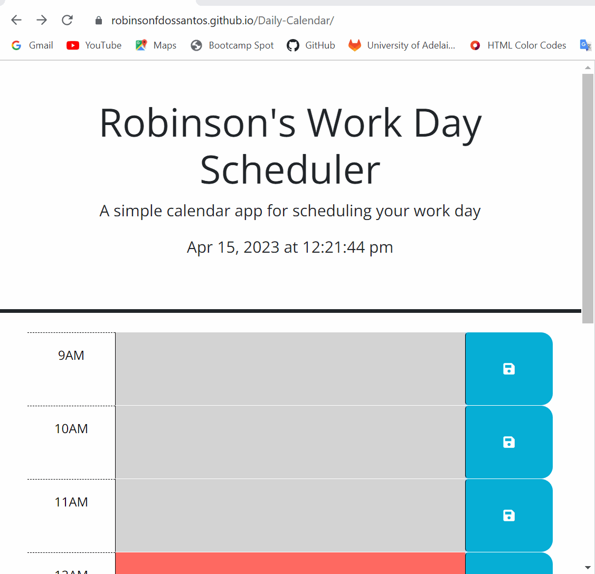

# Third-Party APIs: Work Day Scheduler

## Description

This site was developed using an initial Javascript, HTML and CSS code provided by the tutors as a base to create a Work Day Scheduler. They provided much of the HTML framework, where they created classes and linked them to CSS to style the site.

The challenge was to extend the HTML code and create the interaction using JavaScript to have a business hours scheduler, where all user inputs are saved in LocalStorage and must remain there even if the page is refreshed.

## Usage
The webpage has been developed using VS Code, where the structure was created in HTML, CSS and the interaction with the end-user was developed using Javascript. 

The webpage is an interactive way to help the end-users manage their work activities and create reminders.

The current day and current time are displayed in the page header, which is used to control the page.

The animation below shows how the page will be presented to the user, so it is possible to better understand its functionality, where each line represents an hour of business hours.

It is worth mentioning that the lines receive different colors, it was created to alert the user about the current time, where the current time will be displayed in red, while the past will receive a light gray and the future hours will receive green.

In front of each line a blue button with a save icon is allocated, which must be selected after the entries in the corresponding line to archive the data in localStorage.

## Development & Deployment

The code for creating the site was developed in Javascript, where it was possible to create interaction using events such as "click" on the button and access pre-developed libraries such as DOM, jQuery and Dayjs.

The code was created using DOM, jQuery and Day.js, which summarized the code and connected elements by ID or using methods provided by them.

The screenshot below shows part of the code where a function is created using jQuery and calling the Dayjs framework to display and style dates and times.

### Deployed Website

To visit the website, use the link below.

https://robinsonfdossantos.github.io/Daily-Calendar/

For more information, use the browser's DevTools by typing Ctrl + Shift + I.

## Credits

Members of the Bootcamp team.

Day.js library.

## License

Licensed under the MIT license.

